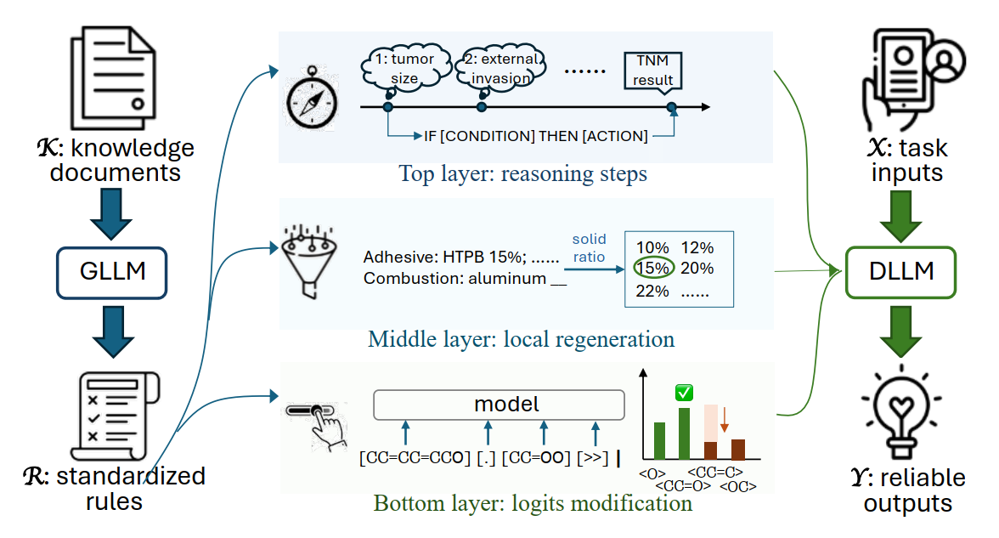

<div align="center">
<h1> Scientific Knowledge-driven Decoding Constraints Improving the Reliability of LLMs
<h5 align="center"> 
  
<a href='xxx'></a>


Maotian Ma<sup>1</sup>,
Zheni Zeng<sup>1</sup>,
Zhenghao Liu<sup>2</sup>,
Yukun Yan<sup>2</sup>,


</h5>
</div>

This is the source code for paper:

Scientific Knowledge-driven Decoding Constraints Improving the Reliability of LLMs

## 📖 Overview

<p align="center"></p>

SciDC is a novel framework that integrates subject-specific scientific knowledge with multi-layered decoding constraints to improve the reliability of large language models in specialized domains. By leveraging general LLMs (e.g., Claude-3.5-Sonnet) to automatically transform flexible knowledge into standardized rules at three granularities (top-layer for reasoning sequences, middle-layer for conditional logic, and bottom-layer for token-level constraints), SciDC enables locally-deployed domain models to generate outputs that strictly adhere to scientific principles while maintaining data privacy. Experiments across industrial formulation design, clinical tumor diagnosis, and chemical retrosynthesis planning demonstrate consistent effectiveness, achieving an average 12% accuracy improvement compared to vanilla generation methods.


## ⚙️ Setup

### Environment

```bash
# Create conda environment
conda create --name scidc python==3.11
conda activate scidc

# Clone repository
git clone https://github.com/Maotian-Ma/SciDC.git
cd SciDC

# Install dependencies
pip install -r requirements.txt
```

### Dependencies
```
torch>=2.0.0
vllm>=0.4.0
transformers>=4.40.0
openai>=1.0.0
```


## 🔧 Reproduction Guide

### 1. Configure API Settings

Edit `config.py` to set your GLLM API credentials:

```python
# GLLM Configuration (for CoT & Constraint Code Generation)
API_KEY = 'your-api-key-here'
API_BASE_URL = 'https://api.anthropic.com/v1'  # or your API endpoint
API_MODEL = 'claude-3-5-sonnet-20241022'
```

### 2. Set Local Model Path

```python
# DLLM Configuration (Local Model for Constrained Generation)
DLLM_MODEL_PATH = "/path/to/your/local/model"  # e.g., Qwen2.5-7B-Instruct
```

### 3. Define Domain Knowledge

Create your domain knowledge document in `prompts/domain_knowledge.txt`:

```text
# Example: TNM Staging Knowledge:

- T (tumor, primary tumor) staging types include:
- Tx: Primary tumor cannot be assessed
- T0: No evidence of primary tumor
- T1: Tumor maximum diameter ≤ 2cm, confined to the thyroid gland
    - T1a: Tumor maximum diameter ≤ 1cm, confined to the thyroid gland
    - T1b: 1cm < tumor maximum diameter ≤ 2cm, confined to the thyroid gland
- T2: 2cm < tumor maximum diameter ≤ 4cm, confined to the thyroid gland
- T3: Tumor maximum diameter > 4cm and confined to the thyroid gland, or gross extrathyroidal invasion involving only the band muscles
    - T3a: Tumor maximum diameter > 4cm, confined to the thyroid gland
...
```

### 4. Define Your Task

```python
# In config.py
USER_TASK = "domain-specific task" #e.g. Determine the TNM staging of the patient's tumor for the following case.
```

### 5. Run the Pipeline

```bash
python run_pipeline.py
```

---


## 📁 Repository Structure

```
SciDC/
├── README.md                          # This file
├── requirements.txt                   # Python dependencies
├── config.py                          # Global configuration
├── run_pipeline.py                    # Main execution entry point
├── cases_data                         # Examples in different domains
├── prompts/                           # Prompt templates & domain knowledge
│   ├── domain_knowledge.txt           # Domain-specific knowledge document
│   ├── task_decomposition.txt         # CoT generation prompt template
│   └── code_generation.txt            # Constraint code generation prompt
│
└── src/
    ├── gllm/                          # General LLM module (Cloud API)
    │   ├── __init__.py
    │   ├── api_client.py              # API communication utilities
    │   └── code_generator.py          # CoT & constraint code generation
    │
    └── dllm/                          # Domain LLM module (Local Execution)
        ├── __init__.py
        ├── dllm.py                    # SciDC core class implementation
        └── constrained_executor.py    # Constraint code execution engine
```


## 🥰 Citation
```
@article{,
  title={Scientific Knowledge-driven Decoding Constraints Improving the Reliability of LLMs},
  author={Maotian Ma, Zheni Zeng, Zhenghao Liu, Yukun Yan},
  journal={xxx},
  year={2026}
}
```


## 📧 Contact
If you have questions, suggestions, and bug reports, please email:
```
2022113389@stu.hit.edu.cn
```
